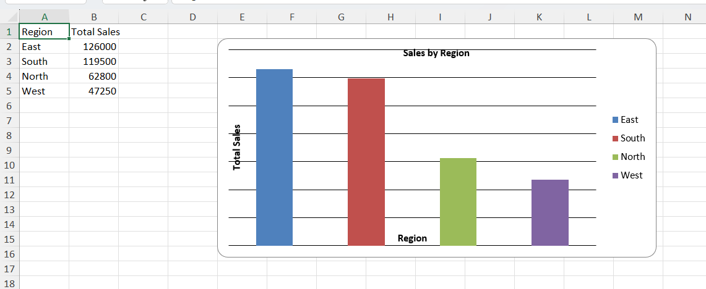
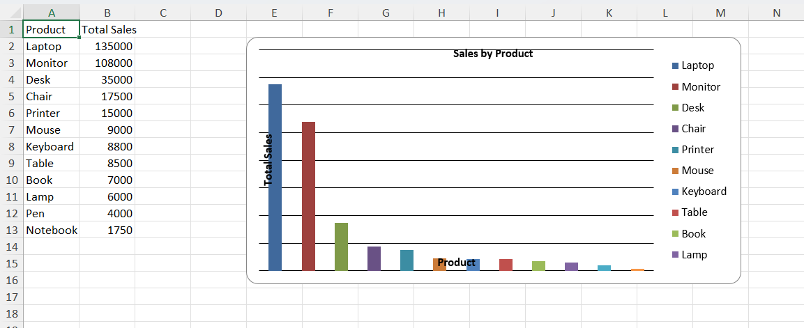
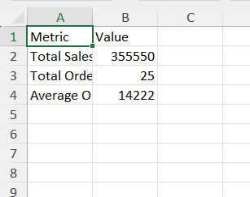

# Automated Data Reporting System

This project automates data cleaning, analysis, and generates professional Excel reports with multiple sheets and visual charts using Python.

## Features

- Data cleaning using Pandas
- Handling missing values and inconsistent formats
- Duplicate removal and data validation
- Business metric calculations (Total Sales, Average Order Value)
- Automated Excel report generation with multiple sheets
- Region-wise, Product-wise, and Salesperson-wise analysis
- Bar chart visualizations using OpenPyXL

## Technologies Used

- Python
- Pandas
- OpenPyXL
- VS Code

## Screenshots

### 📊 Region-wise Sales Report

### 📊 Product-wise Sales Report

### 📊 Summary Report

## Project Structure

automated-data-reporting-system/
│
├── data/
│   └── sales_data.csv  # Raw input data
│
├── screenshots/
│
├── src/
│   └── main.py         # Main script
│
├── .gitignore
└── README.md

## How to Run

1. Clone the repository
2. Install required libraries:
   pip install pandas openpyxl

3. Run the script:
   python src/main.py

4. Check the output folder for the generated Excel report

## Output

The system generates an Excel report containing:

- Cleaned Data
- Summary Metrics
- Region-wise Sales Report (with chart)
- Product-wise Sales Report (with chart)
- Salesperson-wise Performance